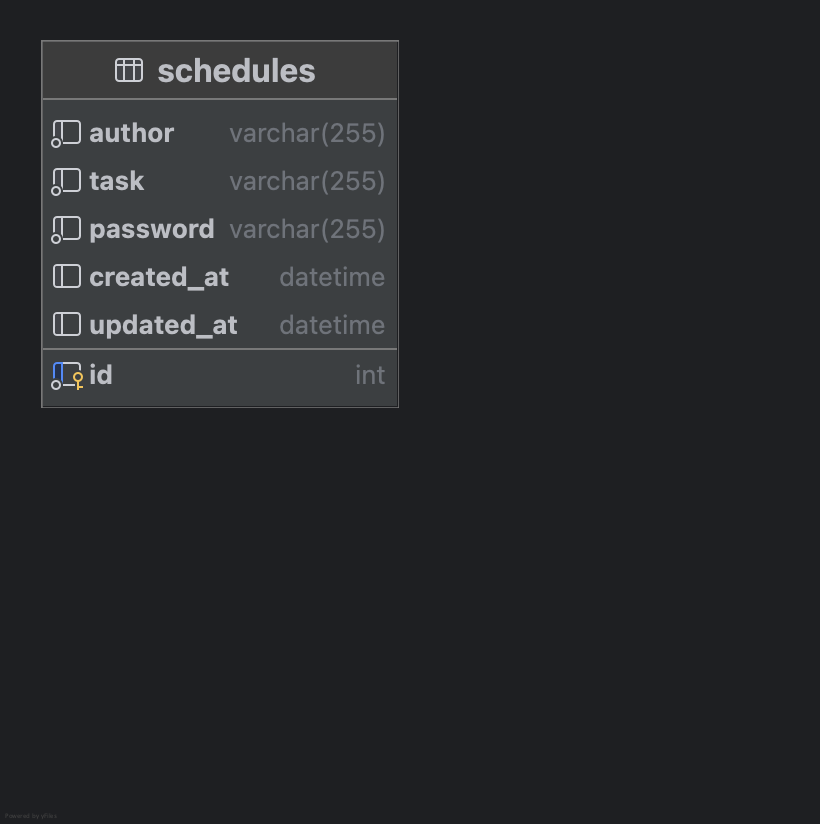

API 명세서
----

1. 새로운 일정 생성
   1. 메서드 - POST
   2. URL - /schedules
   3. 요청 방식  - @RequestBody
   4. 요청 예시 - ```
      { "task": "일정1", 
      "author": "스파르타", 
      "password": "1234" }```

   5. 응답 예시 - 
      ```
      { "id": 1, 
      "task": "일정1", 
      "author": "스파르타", 
      "created_at": "2025-03-25T10:00:00",
      "updated_at": "2025-03-25T10:00:00" }```
   6. HTTP 상태 코드 - 201 created

    
2. 전체 일정 조회
    1. 메서드 - GET
    2. URL - /schedules
    3. 요청 방식  - @RequestParam
    4. 요청 예시 -<br>
   ```?updated_at=2025-03-25&author=스파르타```

   5. 응답 예시 - 
      ```
      { "id": 1, 
      "task": "일정1", 
      "author": "스파르타", 
      "created_at": "2025-03-25T10:00:00", 
      "updated_at": "2025-03-25T11:00:00" }
      ```
   6. HTTP 상태 코드 - 200 OK

      
3. 선택 일정 조회
   1. 메서드 - GET
    2. URL - /schedules/{id}
    3. 요청 방식  - @PathVariable
   4. 요청 예시 - *없음*
   5. 응답 예시 - 
      ```
      { "id": 1, 
      "task": "일정1", 
      "author": "스파르타", 
      "created_at": "2025-03-25T10:00:00",
      "updated_at": "2025-03-25T11:00:00" }
      ```
   6. HTTP 상태 코드 - 200 OK


4. 선택 일정 수정
    1. 메서드 - PUT
    2. URL - /schedules/{id}
    3. 요청 방식  - @RequestBody ,@PathVariable,@RequestParam
   4. 요청 예시 -```{ "task": "일정1 완료","author": "스파게티","password": "1234" }```

   5. 응답 예시 - 
      ```
      { "id": 1, 
      "task": "일정1 완료", 
      "author": "스파르타", 
      "created_at": "2025-03-25T10:00:00", 
      "updated_at": "2025-03-25T12:00:00" }
      ```
   6. HTTP 상태 코드 - 200 OK
      
   
5. 선택 일정 삭제
   1. 메서드 - DELETE
   2. URL - /schedules/{id}
   3. 요청 방식  - @RequestParam,@PathVariable
     4. 요청 예시 -
      ```DELETE localhost:8080/schedules/1?password=1234```

   5. HTTP 상태 코드 - 200 OK

ERD 
----

